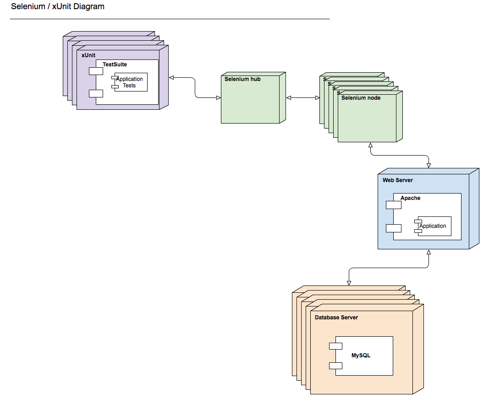

PHP & Selenium Parallel Tests
=============================

Options
-------
1. Standard grid
  - Pros: simple.
  - Cons: All tests sequential.
2. Ant running groups in parallel (evenly split)
  - Pros: easy to setup, does not effect current setup (provided Ant is used as build too), 2 result sets.
  - Cons: tests in group run sequentially, as fast as slowest group.
3. Parallel tests (I. /brianium/paratest )
  - Pros: runs all tests in parallel.
  - Cons: results come back separately.
4. Parallel tests (II. /verkkokauppacom/parallel-phpunit)
  - Pros: runs all tests in parallel.
  - Cons: results come back separately.

Prerequisite
------------
*NB: From project root directory*

1. Hub: java -jar selenium-server-standalone-2.32.0.jar -role hub
2. Slave: java -jar selenium-server-standalone-2.32.0.ja-role node  -hub http://[HUB-IP]:4444/grid/register

Commands
--------
*tests/ directory*

1. phpunit --configuration phpunit-selenium.xml
2. ant -f build-selenium.xml
3. (did not work!) ../vendor/bin/paratest -p 2 -f --phpunit=/usr/bin/phpunit ApplicationTest/Selenium/
4. ./../vendor/bin/parallel-phpunit --pu-threads 2 -c phpunit-selenium.xml ApplicationTest/Selenium/

Results
-------
*NB: 2 tests with 2 assertions, 2 worker agents*

1. 14s 
2. 8s 
3. ---
4. 12s 

Additional info:
---------------- 
Pen testing via zap proxy

Improvements
------------
More tests should be created & run against a larger amount of selenium nodes

Resources
---------

* http://code.google.com/p/selenium/wiki/Grid2
* http://phpunit.de/manual/current/en/index.html
* https://github.com/Element-34/php-webdriver
* https://github.com/brianium/paratest
* https://github.com/verkkokauppacom/parallel-phpunit
* IRC #selenium

Appendix
--------

